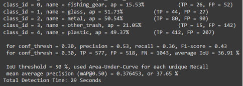
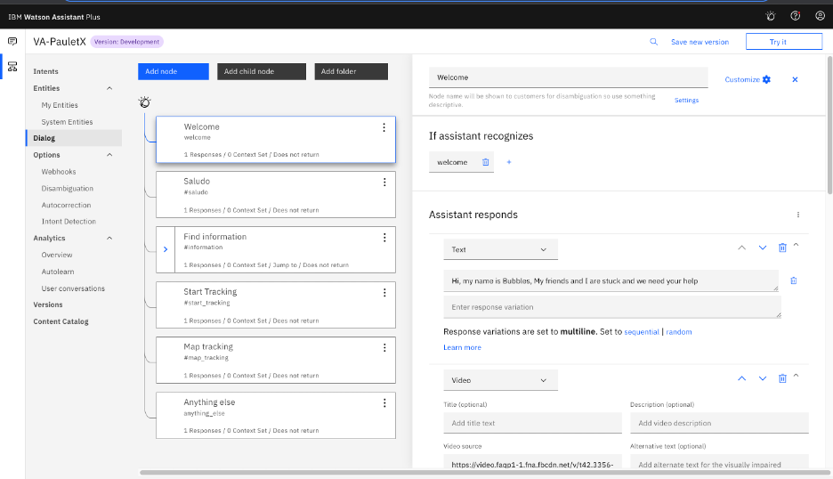
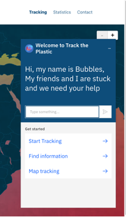
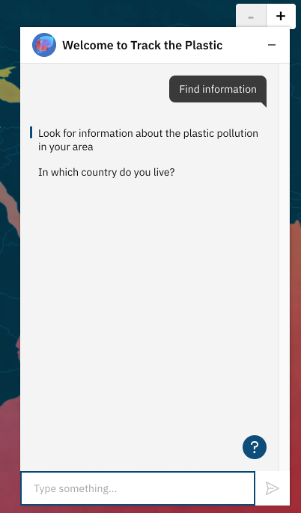
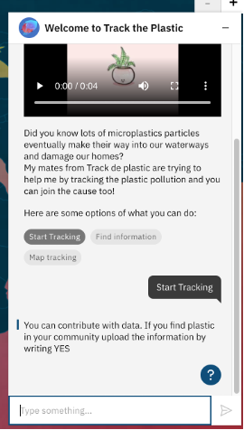
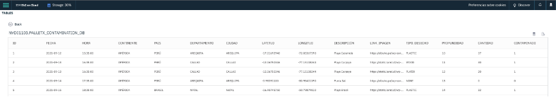

# NASA Space Apps Challenge 2021

This is a [Next.js](https://nextjs.org/) project bootstrapped with [`create-next-app`](https://github.com/vercel/next.js/tree/canary/packages/create-next-app).

You can review the demo app [here](https://nasa-space-apps-challenge-2021.vercel.app/).

## Team
PauletX

## Project
Leveraging AI/ML for plastic marine debris

### Members
- Brenda Heddy Jáuregui Zanabria
- Virginia del Pilar Monroy Malca
- Moisés Albeiro Ñañez Andrés
- Jhonatan Cristobal Camasca Huaman
- Ana Patricia Roncal Alva
- Pedro Ignacio José Eduardo Montenegro Montori

## Getting Started

### Prerequisites

- Node 10 or above
- Yarn

```bash
yarn install
```

### Run locally

Run the development server:

```bash
yarn dev
```

Open [http://localhost:3000](http://localhost:3000) with your browser to see the result.

## ML

### Introduction
The trained model presented is a You Only Look Once (YOLO) version 4 object detector trained in the framework Darknet with 1673 images . These images where collected from the internet by scraping and from open source datasets like Open Images Dataset V6. 
The model can multi-classify five categories: plastic, glass, metal, fishing gear and “other trash”, this final class detects different types of litter that aren’t part of the four categories mentioned before. 
Due to time restrictions, the model was only trained for 3 hours. Despite this restriction, the model was able to detect and classify correctly in many scenarios, meaning that if we train it for more time it will increase its performance.


### General Results



### Training
To train the model, it is recommended to train it via colab from google. For the first configuration, you need to setup a directory in your drive with the dataset, the .cfg model and the .obj files. Additionally, inside this directory you need to create another directory called “backup”.
You can find the weights for the model in this drive in the directory “backup”: https://drive.google.com/drive/folders/1D8XDir3DrATW8Av7zpv2n2L9W-Csk3LZ?usp=sharing 
To start the training you will see that the Jupyter notebook provided has documented each step, so you will need to run from steps “Clonamos Darknet” to “5. Preparando detector”. In this last step just run the code up to the cell that says :

```shell
!./darknet detector train data/obj.data cfg/yolov4_custom.cfg yolov4.conv.137 -dont_show -map
```

Then run the next cell when the training ends to see the loss metric evolution of the model. Additionally, the weights that are being trained will be saved to your backup folder, so if the training is interrupted you can continue it by running the next cell:

```shell
!./darknet detector train data/obj.data cfg/yolov4_custom.cfg /mydrive/yolov4nasa/backup/yolov4_custom_last.weights -dont_show -map
```

Running the model
To run and test the model you have to run all the cells up to the one for training. It is important to not run the cells that start with:
```shell
!./darknet detector train
```

So, you should skip this cells and continue to run the code from the cell that starts with:
```shell
# need to set our custom cfg to test mode 
%cd cfg
!sed -i 's/batch=64/batch=1/' yolov4_custom.cfg
!sed -i 's/subdivisions=16/subdivisions=1/' yolov4_custom.cfg
%cd ..
```
Now you will be able to test your model, just upload the images or videos you want to test the model with.
With the command “!./darknet detector demo” you can test the model with a video, the “-thresh” parameter is the precision limit considered for the model to classify an object to a category or another. Furthermore, with the command “!./darknet detector test” you will be able to test the model with an image. Finally with “!./darknet detector map” you will be able to get all the metrics (mean Average Precision, mean seconds for each detection, Accuracy, Intersection Over Union, and Precision for each class) for the model, testing it through the validation set.

## Virtual Assistant

Our assistant was developed with the IBM Waston Assistant service, which can be found within the IBM Cloud catalog. The development of this virtual assistant was done through the interface provided by WA and the development output is a json file [skill-VA-PauletX.json](./skill-VA-PauletX.json).





This virtual assistant was developed with two objectives:

1. Provide statistical information on how pollution is progressing in the world, as well as information that comes from NASA's main sources.



2. Interface so that users can contribute with us and with the world and be able to upload images in real time about contaminated places that they identify themselves, to make a call to action, since an early identification of contamination in coastal areas will help to that you are not ending up in the ocean.



### DataBase as a Service
At this point we created a database as a service that allows us to save the information collected by the virtual assistant and the computer vision algorithm from scratch, so that later this information feeds our global map of heat and contaminated points and the statistical information dashboard. The main attributes of the main table “PAULETX_CONTAMINATION_DB” are: ID, FECHA, HORA, CONTINENTE, PAIS, DEPARTAMENTO, CIUDAD, LATITUD, LONGITUD, DESCRIPCION, LINK_IMAGEN, TIPO_DESECHO, PROFUNDIDAD, CANTIDAD, CONTAMINADO  



